# 1. Architecture Overview

[Next >>](0003-migration.md)

Date: 2024-02-03

## Status

Accepted

## Context

Incident Reporting System (IRS) is a new system that will be used to record incidents that occur in prisons. This document illustrates where this fits into the wider architecture.

### Components
High level set of components that would make up the flow of data around the incident reporting service.

#### Proposed Architecture
The proposed architecture for the incident reporting system (IRS) is as follows:

- **Incident Reporting API** - A RESTful API to allow the creation of incidents, viewing and managing existing incidents. 
The API models new incident data seperately from the existing migrated IR data from NOMIS.
The API will receive updates from NOMIS via Syscon APIs when reports are completed.

- **Front end application** to allow staff to create, updated and view historical incident reports. Each incident type will be delivered in phases. For each support incident report that type will be removed from NOMIS, meaning that no new reports of that type can be created in NOMIS.

- **Incident database** to store incident reports and all migrated data from NOMIS

#### Other components and interactions with IRS
- Digital Prison Reporting (DPR) - The DPR system will be the source of truth for reporting incident data.
- NOMIS - The legacy system that will be replaced by the new IRS.
- Audit Service - The audit service will receive and record audit events from the IRS.
- Analytics Platform - The analytics platform will obtain data sets from DPR to provide insights and reporting.
- Safety Diagnostic Tool - The Safety Diagnostic Tool will obtain data from DPR to provide insights and reporting.
- Performance Hub - The Performance Hub will obtain data from DPR to provide insights and reporting.
- SYSCON APIs - These API/systems will migrate all incident data to IRS. 

Below illustrate these components and how they interact with each other.

```mermaid
flowchart TB

subgraph prisonStaff[Prison Staff]
    h1[-Person-]:::type
    d1[Prison Staff \n with NOMIS account]:::description
end
prisonStaff:::person

prisonStaff--Create Incident Reports -->incidentReportApplication
prisonStaff--Create Incident Reports -->oracleForms

subgraph incidentReportingService[Incident Reporting Service]
    subgraph incidentReportApplication[Incident Reporting Application]
        direction LR
        h2[Container: Node / Typescript]:::type
        d2[Workflows and incident reporting creation]:::description
    end
    incidentReportApplication:::internalContainer

    subgraph incidentReportingApi[Incident Reporting API]
        direction LR
        h5[Container: Kotlin / Spring Boot]:::type
        d5[Provides incident report\n functionality via a JSON API]:::description
    end
    incidentReportingApi:::internalContainer

    subgraph database[Incident Reporting Database]
        direction LR
        h6[Container: Postgres Database Schema]:::type
        d6[Stores incidents, \n historical data and history]:::description
    end
    database:::internalContainer

    incidentReportApplication--JSON calls -->incidentReportingApi
    incidentReportingApi--Reads from and \n writes to -->database
end
incidentReportingService:::newSystem

incidentReportingApi--Publishes incidents \n created/updated events -->domainEvents
incidentReportingApi--Audits changes -->auditService
incidentReportApplication--Creates reports from -->dpr

subgraph ap[Analytics Platform]
    subgraph dataIngestion[Data Ingestion and Processing]
        subgraph apService[Platform Service]
            direction LR
            h418[Mixed]:::type
            d419[Ingestion and Processing of Data sets]:::description
        end
        apService:::internalContainer
    end
    dataIngestion:::internalSystem
end

apService-- obtains data sets from -->dpr
    
subgraph digitalServices[Digital Services]
    
    subgraph auditSystem[Audit Services]
        subgraph auditService[Audit Service]
            direction LR
            h62[Container: Kotlin / Spring Boot]:::type
            d62[Receives and records audit events]:::description
        end
        auditService:::internalContainer
    end
    auditSystem:::internalSystem

     subgraph dpr[Digital Prison Reporting]
         subgraph redshift[AWS Redshift Data warehouse]
             direction LR
             h41[Data warehouse]:::type
             d41[Ingestion and Processing of Data sets]:::description
         end
         redshift:::internalContainer
     end
     dpr:::internalSystem
end

dpr-- extracts data from NOMIS-->nomisDb
dpr-- extracts data from Incident DB-->database

subgraph NOMIS[NOMIS Environment]

    subgraph sysconApis[Syscon Services]
        direction LR
        h82[Container: Kotlin / Spring Boot]:::type
        d82[Migration and Sync Management Services]:::description
    end
    sysconApis:::sysconContainer
    
    subgraph oracleForms[NOMIS front end]
        direction LR
        h91[Container: Weblogic / Oracle Forms]:::type
        d91[Incident Reports set to Edit only]:::description
    end
    oracleForms:::legacyContainer
    
    subgraph nomisDb[NOMIS Database]
        direction LR
        h92[Container: Oracle 11g Database]:::type
        d92[Stores core \n information about prisoners, \n prisons, finance, etc]:::description
    end
    nomisDb:::legacyContainer

    subgraph nomisMISDb[MIS Database]
        direction LR
        h93[Container: Oracle 11g Database]:::type
        d93[NOMIS Reporting System]:::description
    end
    nomisMISDb:::legacyContainer
    
    nomisMISDb-- extracts data from -->nomisDb
    oracleForms-- read/write data to -->nomisDb
end
NOMIS:::legacySystem
sysconApis-- migrates all completed Incident reports  -->database

subgraph otherServices[Other Services]

    subgraph performanceHub[Performance Hub]
        direction LR
        h191[Container: python]:::type
        d191[Prison Performance Data]:::description
    end
    performanceHub:::legacyContainer

    subgraph sdt[Safety Diagnostic Tool]
        direction LR
        h192[Container: R]:::type
        d192[Incident Reports Tool]:::description
    end
    sdt:::legacyContainer


end
otherServices:::legacySystem

apService-- sends data to --> sdt
apService-- sends data to -->performanceHub
    
%% Element type definitions

classDef person fill:#90BD90, color:#000
classDef internalContainer fill:#1168bd, color:#fff
classDef legacyContainer fill:purple, color:#fff
classDef sysconContainer fill:#1168bd, color:#fff
classDef internalSystem fill:#A8B5BD
classDef newSystem fill:#D5EAF6, color:#000
classDef legacySystem fill:#A890BD, color:#fff


classDef type stroke-width:0px, color:#fff, fill:transparent, font-size:12px
classDef description stroke-width:0px, color:#fff, fill:transparent, font-size:13px

```

[Next >>](0003-migration.md)