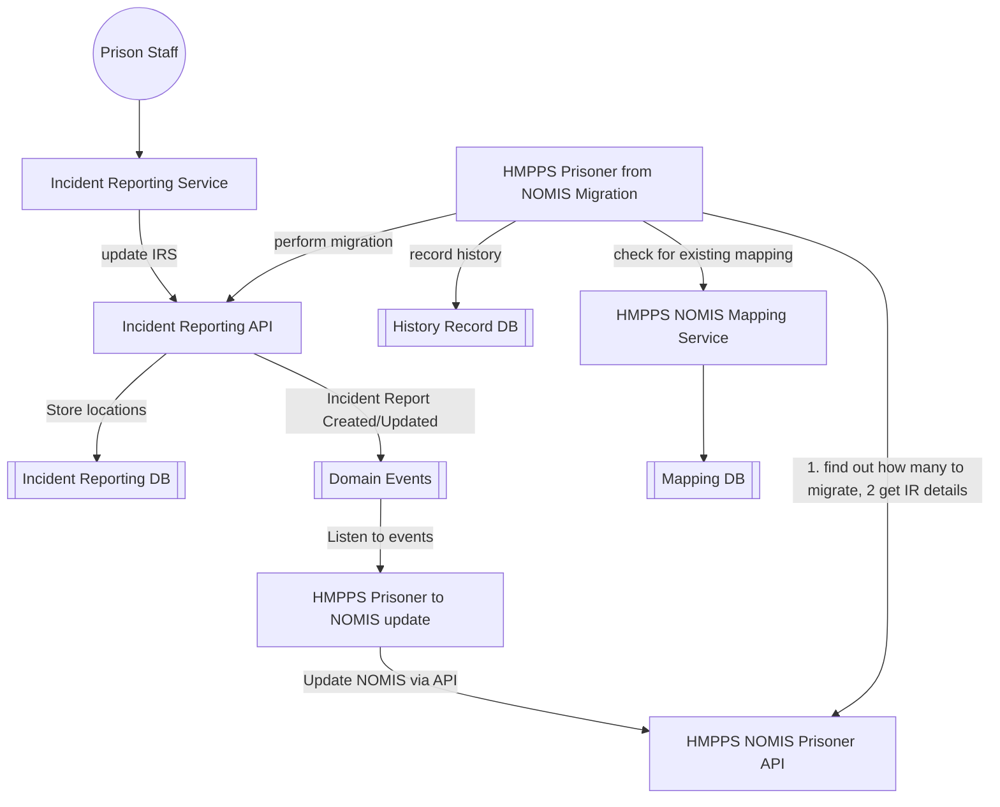

# 1. Mastering and synchronisation of Internal location data with NOMIS

[Next >>](0004-location-db-design.md)

Date: 2024-01-23

## Status

Accepted

## Context

This document will cover the approach for the migration of the "Incident Reporting Service" from NOMIS to a new service and how data will be maintained and made available to down-stream systems.
### Migration plan for "Incident Reporting Service" 

Incident reports will **not** be kept in sync and **no** data will be written back to NOMIS. 
There will be a one-off migration of all completed incidents from NOMIS to the new service.

The proposed approach will be :-
- Migrate all incident reporting data from NOMIS to the new service in a one of process.  These records will be read only and will be used for historical reporting and analysis. Records still process will also be read only and can only be "completed" in NOMIS.
- In NOMIS switch off the ability to create _new_ incidents of agreed types. E.g. Self harm, Assaults and Finds. No new incidents of these types will be able to be created in NOMIS. Existing records can still be edited until "Closed"
- Incident types can be removed on a per prison basis, for example a set of prisons can only create new incidents (of certain types) in the new service (IRS).  Other prisons can continue to use NOMIS for these types. 
- SYSCON will need to modify the incident reporting screens in NOMIS to be "edit only" for certain incident types on a per-prison basis.
- Existing reports in progress it will be kept in sync to the new IRS. 
- All records originating in NOMIS will **not** be editable.
- As old reports can be altered for many years, there will be a hard cut-off of 6-12 months on how long records can be edited in NOMIS.  After this a backend admin screen will allow these changes in DPS only.  At this point NOMIS incident screens will be removed and the NOMIS -> DPS sync will be dropped.
- The migration process will contain all the incident data, included the question and answers used at the time and all historical changes made to that incident report.
- The migrated data will be available for searching and viewing in the new service but will be read only. (except where mentioned above for special circumstances).
- The new service will be the source of truth for all new incidents and will be the only place to create new incidents (of the types defined).
- New incidents data will be ingested into the DPR system for reporting and down-steam applications to consume. 
- Migrated incidents will also be ingested into the DPR system as we will want to move the need for DPR to go to NOMIS for incident data and occasionally old reports may require edits (after NOMIS screens have been removed).
- The DPR system will also contain all the NOMIS incident reporting data and be used by the analytics platform, at a future point this data needs to be synchronised from the new service.
- These downstream systems will need to take incident data from **two** models (both in DPR) i.e. new incidents from the new service and historical incidents from NOMIS.
- SDT and performance hub for reporting and analysis will take their data from AP (analytics platform) but could at some future point pivot to use DPR. 
- Over-time all other incident types will be moved to the new service and creation removed from NOMIS.
- Once all incident types have been moved to the new service, the NOMIS incident reporting service will be decommissioned, reports turned off, screens removed, data removed from the system, code removed and tables dropped.

Steps needed:
**Incident reporting team.**
- Model the Incident Reporting data in a new database, 
- Model the legacy data from NOMIS for migration and historical viewing.
- Develop front end application for managing incidents and viewing historical incidents. Allow switch on per prison and type.
- Build API functionality for managing both data sets
- Raise events on creation or amendments of incidents
- Provide API endpoint for consuming incidents to replace Prison API endpoint used by CatTool.  This should combine both legacy and new data models.
- Build "migrate" endpoint to allow NOMIS to send incident report data to API, this will be a continuous 1 way sync whilst edit of old reports is allowed.
- Setup pipelines to DPR to allow new incidents to be ingested into this system.

**SYSCON team**
- Migrate all incidents in NOMIS by calling API "migrate" endpoint, continue to drip feed these as they change.
- Change IRS screen in NOMIS to **edit only** mode for certain incident types in defined prisons.
- Remove all incident endpoints in prison-api once all services are using new API.
- Remove reports, screens, data, code and tables once all incident types migrated and reports are replaced

## Key components and their flow for incident reporting

[Next >>](9999-end.md)
