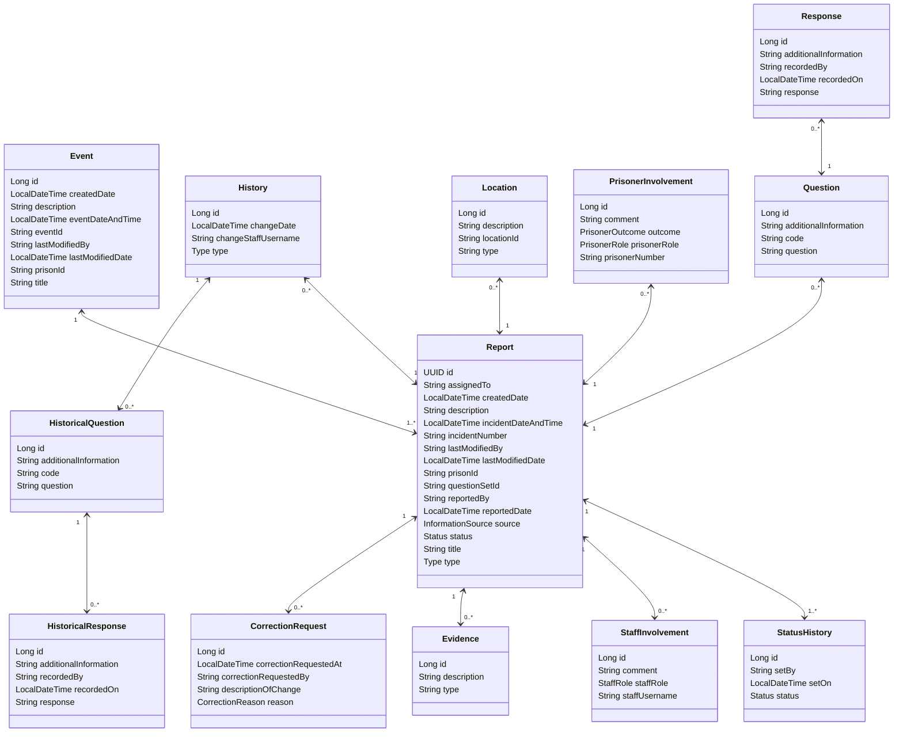
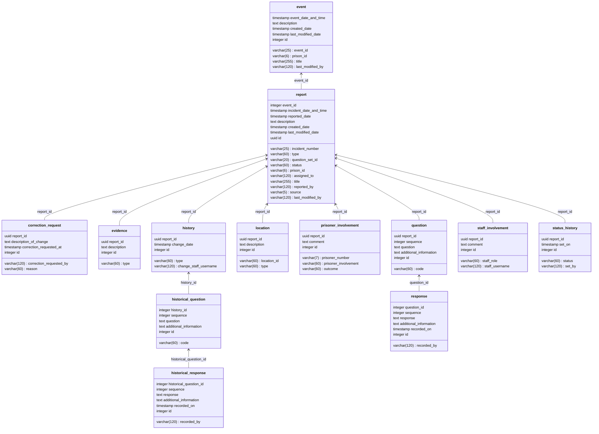

# 4. A new modelling for the Incident Reporting Service

[Next >>](9999-end.md)

Date: 2024-03-04

## Status

Accepted

## Context
This document details the new design of Incident Reports that will support old NOMIS model and a new more flexible model for the Incident Reporting Service.

### ER Schema

### DB Schema

